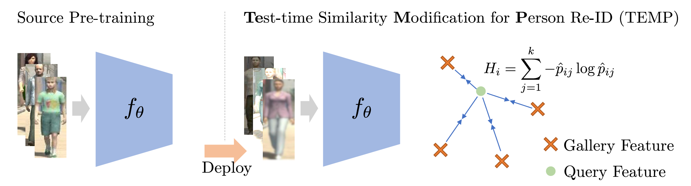

# Test-time Similarity Modification for Person Re-identification toward Temporal Distribution Shift (IJCNN 2024)
The official implementation for IJCNN 2024 paper "Test-time Similarity Modification for Person Re-identification toward Temporal Distribution Shift."  
[[Paper](https://ieeexplore.ieee.org/abstract/document/10650113)] [[arXiv](https://arxiv.org/abs/2403.14114)] [[Poster](https://kzkadc.github.io/assets/publications/ijcnn2024_reid-tta.pdf)]

<details><summary><strong>Abstract</strong></summary>
Person re-identification (re-id), which aims to retrieve images of the same person in a given image from a database, is one of the most practical image recognition applications. In the real world, however, the environments that the images are taken from change over time. This causes a distribution shift between training and testing and degrades the performance of re-id. To maintain re-id performance, models should continue adapting to the test environment's temporal changes. Test-time adaptation (TTA), which aims to adapt models to the test environment with only unlabeled test data, is a promising way to handle this problem because TTA can adapt models instantly in the test environment. However, the previous TTA methods are designed for classification and cannot be directly applied to re-id. This is because the set of people's identities in the dataset differs between training and testing in re-id, whereas the set of classes is fixed in the current TTA methods designed for classification. To improve re-id performance in changing test environments, we propose <em>TEst-time similarity Modification for Person re-identification (TEMP)</em>, a novel TTA method for re-id. TEMP is the first fully TTA method for re-id, which does not require any modification to pre-training. Inspired by TTA methods that refine the prediction uncertainty in classification, we aim to refine the uncertainty in re-id. However, the uncertainty cannot be computed in the same way as classification in re-id since it is an open-set task, which does not share person labels between training and testing. Hence, we propose re-id entropy, an alternative uncertainty measure for re-id computed based on the similarity between the feature vectors. Experiments show that the re-id entropy can measure the uncertainty on re-id and TEMP improves the performance of re-id in online settings where the distribution changes over time.
</details>



## 0. Environment
- Prepare the datasets (Market-1501, MSMT17, PersonX) according to the [OpenUnReID's document](docs/INSTALL.md).
- Install dependencies or build the docker image according to `docker/Dockerfile`.

```bash
$ docker build -t reid-tta docker --no-cache
```

## 1. Training the source model
- Edit `tools/source_pretrain/config.yaml` appropriately, e.g., `DATA_ROOT`, `LOGS_ROOT`, `TRAIN/datasets`, etc.

```bash
# train
$ docker run -it --rm -w $(pwd) -v $(pwd):$(pwd) --gpus device=0 -e GPUS=1 -e METHOD=source_pretrain -e WORK_DIR=source_pretrain/market1501 reid-tta bash exec_dist_train.sh

# test
$ docker run -it --rm -w $(pwd) -v $(pwd):$(pwd) --gpus device=0 -e GPUS=1 -e RESUME="../logs/source_pretrain/market1501/checkpoint.pth" -e CONFIG="../logs/source_pretrain/market1501/config.yaml" -e ARGS="TEST.LOADER.workers_per_gpu 1" reid-tta bash exec_dist_test.sh
```

- Pre-trained source models are available in [logs/source_pretrain](/logs/source_pretrain).

## 2. Test-time adaptation
- Our method is implemented upon [OpenUnReID](https://github.com/open-mmlab/OpenUnReID).
- Edit `tools/TEMP/config.yaml` appropriately, e.g., `DATA_ROOT`, `LOGS_ROOT`, `TRAIN/datasets`, etc.

```bash
$ docker run -it --rm -w $(pwd) -v $(pwd):$(pwd) --gpus device=0 -e GPUS=1 -e METHOD=TEMP -e WORK_DIR=TEMP/market1501 reid-tta bash exec_dist_train.sh
```

- The config file can be switched by specifying `-e CONFIG=another_config.yaml`.

## Citation
If our work assists your research, please cite our paper:

```
@INPROCEEDINGS{adachi2025temp,
  author={Adachi, Kazuki and Enomoto, Shohei and Sasaki, Taku and Yamaguchi, Shin'ya},
  booktitle={2024 International Joint Conference on Neural Networks (IJCNN)}, 
  title={Test-time Similarity Modification for Person Re-identification toward Temporal Distribution Shift}, 
  year={2024},
  doi={10.1109/IJCNN60899.2024.10650113}}
```
